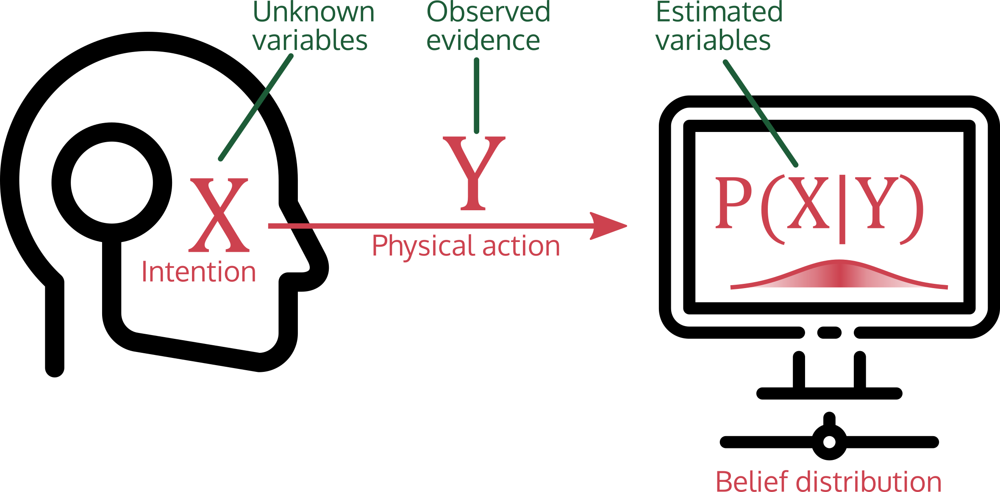
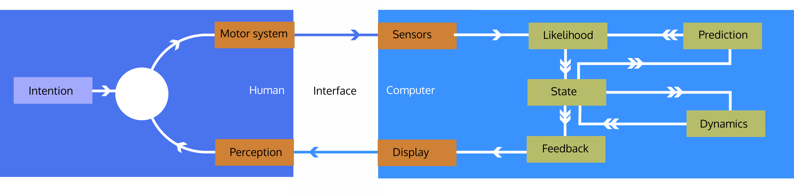

## ACM SIGCHI Course on Bayesian Methods in HCI

$$\newcommand{\vec}[1]{{\bf #1} } 
\newcommand{\real}{\mathbb{R} }
\newcommand{\expect}[1]{\mathbb{E}[#1] }
\DeclareMathOperator*{\argmin}{arg\,min}
\vec{x}
\real
$$

# What is Computational Interaction?
Computational interaction applies computational thinking (abstraction, automation, analysis) to explain and enhance interaction between a user and a system. It is underpinned by modelling which admits formal reasoning, and which is amenable to computational approaches.

Computational interaction draws on insight from machine learning, signal processing, information theory, optimisation, Bayesian inference, control theory and formal modelling . It emphasises generating motor themes in HCI, and robust, replicable and durable approaches which go beyond point sampling of the interaction space.

### Computational interaction would typically involve at least one of:
* I. an explicit mathematical model of user-system behavior;
* II. a way of updating that model with observed data from users;
* III. an algorithmic element that, using this model, can directly synthesise or adapt the
design;
* IV. a way of automating and instrumenting the modeling and design process;
* V. the ability to simulate or synthesise elements of the expected user-system behavior.

Computational interaction often involves elements from machine learning, signal processing, information theory,
optimisation, inference, control theory and formal modelling.


# Probabilistic filtering for intention inference

#### Inferring user intention in a noisy world
----

    All theorems are true. 
    All models are wrong. 
    And all data are inaccurate. 

    What are we to do? 
    We must be sure to remain uncertain.

-- *[Leonard A. Smith, Proc. International School of Physics ``Enrico Fermi", (1997)](http://www2.maths.ox.ac.uk/~lenny/fermi96_main_abs.html)* 


## Topic purpose

This section will cover probabilistic **inference**. Rather than learning a single set of parameters by optimisation, we can infer probability distributions over possible models that might be compatible with our data.  We will develop the idea of **probabilistic filtering** to rigorously define the interaction problem as online probabilistic inference, and derive practical algorithms that can be fuse together input device signals across time and across sensors channels. This will give us a robust, theoretically underpinned way of combining together sensing into estimates of intention.


### Why is this relevant for computational HCI?
* We will build **statistical models** of user behavior, and estimate parameters of that model from quantitative observations of data. This is a **model-led approach** which has a rich mathematical underpinning and many powerful algorithmic tools which can be brought to bear.

* This is **robust** (it appropriately represents uncertainty) and **generative** (it can simulate behaviour compatible with observations).  

### What will we *practically* do?
TBD


## Outline 

### Interaction is inference
* <a href="#inference"> Show how to represent interaction problems as inference and discuss how probabilistic filters can be used to attack these inference problems </a>
* <a href="#alternatives"> Discuss *alternative* approaches to solving interaction problems </a>
* <a href="#principles"> Discuss principles behind probabilistic tracking of belief </a>

### Probability refresher
* <a href="#rvs"> Introduce random variables and distributions </a>
* <a href="#bayesian"> Outline Bayesian inference </a>
* <a href="#combining"> Show how Bayesian inference can be used to fuse data across time and across sensors </a>


* <a href="#terminology"> Introduce the basic terminology for probabilistic filters</a>
### Kalman filtering
* <a href="#noisycursor"> Experiment with *noisy cursors* </a>
* <a href="#cursormodel"> Model the cursor problem probabilistically </a>
* <a href="#kalman"> Discuss the Kalman filter and its assumptions </a>
* <a href="#kalmantest"> Build and run a simple Kalman filter on offline static data </a>
* <a href="#practical"> **Practical**: build an online Kalman filter to  recover corrupted cursor input probabilistically </a>
* <a href="#kalmanlitations"> Discuss the limitations of the Kalman filter</a>


------

<a id="inference"> </a>
# Interaction as inference
One view on interaction is to see user intentions as **unknown values** which are partially observed through input sensors. The time series of inputs from the user only give a partial, noisy, incomplete view of intention inside the user's head. 

Probabilistic filtering **(PF)** tracks the evolution of some unknown variables *[user intentions]* given observed evidence *[user input]*, in a way that is **robust**. Probabilistic filters infer a **distribution** over possible hidden (unobserved) variables, updating them over time. These filters are inherently **uncertain**, as they represent degrees of belief, and **dynamic**, as they explicitly model changing state over time.





#### Simulation viewpoint
These filters are really *simulators*. They *simulate* how possible user behaviors might unfold over time. In some probabilistic filters, hundreds of parallel simulators are run, each with slightly different parameters. In all cases, the simulations are adjusted online to better match observed reality. The internal parameters that drive the simulation are the *unknown variables* we want to infer and the *evidence* is the observed reality that adjusts the simulation parameters.

#### Properties
Probabilistic filtering is:

| Property | Why  |
|----------|------|
|**Bayesian**  |  Represents degrees of belief using probability distributions.    |
|**predictive**  |  Works by comparing predictions with reality.   |
|**generative** |  Involves generating (i.e. simulating) behavior.   |

-----
Probabilistic filtering is an **inverse probability** approach, and it requires that we think of interaction from an unique perspective. We have to explicitly be able to write down:

* what we want to know (i.e. the **state space of intention**);
* how that will change over time (i.e. the **dynamics of intention**);
*  a model that *if we knew what the user intention was, what the expected behavior would be* (i.e. a **generative function mapping intention -> expected user inputs**).

Note that this last point is the **inverse** of the typical way of approaching this problem, where we would try and find a mapping from a sensors to intention, by design or by learning. 


### Why is this computational HCI?
Probabilistic filtering means writing down an **executable, statistical model** of user behavior, then **running an inference algorithm** that updates beliefs based on the way observations evolve. The **parameters** of the filter can be **learned from user data**. The effectiveness of the filter can be quantitatively measured.


<a id="alternatives"> </a>
### What are competitive approaches?
#### **Crafted mappings**
**where we try to find (by hand) transforms from sensors to intentions that are  simple or obvious.**

**Example:** a button, which has two physical states, and maps on to two intentional states via two electrical states. Pushed down = current flows = user intended to switch on. The mapping from electrical states to intentional states is **designed.**

*[Image credit: David Singleton via flickr.com CC-BY 2.0]*

#### **Machine learned mappings**
**where we train a system to recognize a class of input patterns as being representative of an intended behavior. **
**Example:** Finger gesture recognizer; hundreds of examples of many users performing one of N multi-touch gestures are recorded. These are used to train a random forest to classify the intended gesture. The mapping from electrical states (capacitive sensors) to intentional states is **learned**.


*[Image credit: Elisfm - via Wikimedia Commons; public domain]*


### Benefits
* **Robustness to noise** PFs work well even with input sensors that are noisy.
* **Robustness to poorly specified models** PFs can cope predictably even if our models are bad.
* **Robustness to intermittence** PFs can continue to sensibly interpolate when input cuts out.
* **Uncertainty estimates** PFs *know how certain they are* and this can be used in the interaction design.
* **Decoupled from real-time** PFs can infer past (smoothing), present (filtering) and future (forecasting).
* **Inherent fusion of multiple input sensors** PFs are often used to solely to fuse together multiple inputs from different sensors.
* **Better feedback** PFs  offer the opportunity to give users rich insight into the process of intention decoding.
* **Flexible modeling** PFs can incorporate both fundamental modeling (e.g. physiological or cognitive models) and data-driven machine learning.

# Principles 
-------

> Interaction is the process of driving a system into a state compatible with user intentions.

There are many perspectives on interaction from this stance, including:

| Perspective   | Burden | Characteristic                         |
|---------------|--------|----------------------------------------|
| Communication | User   | User gets information into the system, by encoding intentions. |
| Control       | Split  | User drives state towards intention via feedback control.   |
| Inference     | System | System infers what user intention is from sensed user actions. |

### Interaction as inference
If we view interaction as inference of intention, there are three elements:
* **Interaction is inference**; it is the process of inferring a hidden variable: what the user wants a system to do. 
* **Observations are noisy and incomplete** What a system sees is a distorted and incomplete representation of user actions in the world, which are in turn a noisy representation of internal intentions (your hand does not always go where you want it...)
* **Interaction occurs over time** Interaction is a *process* that evolves over time. Information flow is not instantaneous.


# Probability refresher

## Random variables and distributions
A **random variable** is a variable that can take on different values, but we do not know what value it has; i.e. one that is "unassigned". However, we have some knowledge which captures the possible states the variable could take on, and their corresponding probabilities. Probability theory allows us to manipulate random variables without having to assign them a specific value.

A random variable might represent the outcome of dice throw (discrete); whether or not it is raining outside (discrete: binary); the height of person we haven't met yet (continuous); the position of a user's hand (continuous, multi-dimensional);. 

## Distributions
A **probability distribution** defines how likely different states of a random variable are. 

We can see $X$ as the the *experiment* and $x$ as the *outcome*, with a function mapping every possible outcome to a probability. We write $P(x)$ to mean the probability of $P(X=x)$ (note the case!), that is that $X$ takes on a value $x$.

$$P(X=x),\  \text{the probability of random variable X taking on value x}\\
P(X),\  \text{shorthand for probability of X=x }\\
P(x),\  \text{shorthand for probability of specific value X=x }\\
$$

### Discrete and continuous
Random variables can be continuous (e.g. the height of a person) or discrete (the value showing on the face of a dice). 

* **Discrete variables** The distribution of a discrete variable is described with a **probability mass function** (PMF) which gives each outcome a specific value; imagine a dictionary mapping outcomes to probabilities. The PMF is usually written $f_X(x)$, where $P(X=x) = f_X(x)$. The probability distribution is *defined* by the PMF.

* **Continuous variables** A continuous variable has a **probability density function** (PDF) which specifies the spread of the probability as a *continuous function* $f_X(x)$. It is **not** the case that $P(X=x) = f_X(x)$ for PDFs. The probability distribution is *defined* by the PDF.

We will work with continuous variables, but we will always write code that works on distinct values (samples) from a distribution. This makes the code easy to write.

## Random variables

* Defined over a set of outcomes (e.g. `{heads, tails}` or the real numbers)
* Defined by a function: probability mass or density function, which maps each outcome to a "belief weight" such that the integral/sum of all weights is 1.0
* Key operations:
    * **Expectation** Take an **expectation** Compute an "average" of some function of a random variable
    * **Sample**, simulating an example from a random variable
    * **Likelihood**, which just evaluates the density/mass function at some value. We typically want to be able to compute the log-likelihood, as a more computationally useful form.


We usually want to be able to apply these operations to many values at once.

```python
    # A definition of a probabilty distribution in Python
    class DiscreteRandomVariable:
        def __init__(self, pmf):
            self.pmf = pmf

        def lik(self, outcomes):                
            """Compute the probability of a specific outcome being observed."""
            return np.prod((self.pmf[outcome] for outcome in outcomes))

        def llik(self, outcomes):
            """Return the log-likelihood; we would usually define this differently
            and obtain the log likelihood directly and never use a lik() function, but
            this is convenient here"""
            return np.sum((np.log(self.pmf[outcome]) for outcome in outcomes))

        def sample(self, n):
            """Draw a random sample from this random variable"""
            samples = []
            for i in range(n):
                r = np.random.uniform(0,1) # random on unit interval
                sum_p = 0
                # find which bin the random number fell into
                for outcome, p in self.pmf:
                    sum_p += p
                    if r < sum_p:
                        samples.append(outcome)
                        break

        def expectation(self, fn):
            """Return the average value of fn applied to this random variable,
            by summing the products of the function applied to each value and the
            corresponding probability"""
            return sum(fn(outcome)*p for outcome, p in self.pmf.items())

        def mc_expectation(self, fn, n):
            """Approximate an expectation using Monte Carlo; i.e. sample a bunch of examples
            and then compute the average value of those samples. This works even if we
            can't evaluate the pmf everywhere."""
            return np.mean(fn(sample) for sample in self.sample(n))
```        

We can use this to model simple random systems:

```python
coin = DiscreteRandomVariable({"heads":0.5, "tails":0.5})
print("Likelihood of HHH", coin.lik(["heads", "heads", "heads"]))
print("Log-likelihood of HHH", coin.llik(["heads", "heads", "heads"]))
print("Sample of coin tosses", coin.sample(5))

# this is an arbitrary function that gives 5 "points" for a heads, and 0 points for
# a tails
def value_fn(toss):
    return 5.0 if "heads" else 0.0

print("Expectation under value_fn", coin.expectation(value_fn))
print("Approx. expectation under value_fn", coin.mc_expectation(value_fn, 100))

```


## Samples and sampling
**Samples** are observed outcomes of an experiment; we will use the term **observations** synonymously. We can **sample** from a distribution; this means simulating outcomes according to the probability distribution of those variables. 

For discrete random variables, this is easy: we simply produce samples by drawing each outcome according to its probability. (For continuous variables, we need to use specific algorithms to draw samples according to a distribution.)


## Distributions over vector spaces

Diagram: vector blob

Continuous distributions generalise discrete variables (probability mass functions) (e.g. over $\mathbb{Z}$) to continuous spaces over $\real$ via probability density functions. 

Probability densities can be further generalised to vector spaces, particularly to $\real^n$. This extends PDFs to assign probability across an entire vector space, under the constraint that the (multidimensional integral) $$\int_{x\in\real^n} f_X (x) =1, x \in \real^n.$$ 

Distributions with PDFs over vector spaces are called **multivariate distributions** (which isn't a very good name; vector distributions might be clearer). However, they typically require more parameters to specify their form, since they can vary over more dimensions.


The normal distribution is very widely used as the distribution of continuous random variables. It can be defined for a random variable of *any dimension* (a distribution over any real vector space, including infinite ones!); a **multivariate normal** in statistical terminology.

A multivariate normal is fully specified by a **mean vector** $\vec{\mu}$ and a **covariance matrix** $\Sigma$. If you imagine the normal distribution to be a ball shaped mass in space, the mean *translates* the mass, and covariance applies a *transformation* matrix (scale, rotate and shear) to the ball to stretch it out into an ellipse. All normal distributions have an elliptical shape with highest density at the mean and falling off towards the edges.

We can now talk about the **joint probability density** (density over all dimensions) and the **marginal probability density** (density over some sub-selection of dimensions).

For example, consider $X \sim N(\vec{\mu}, \Sigma), X \in \real^2$, a two dimensional ("bivariate") normal distribution. It has a distribution $P(X_0,X_1)$  or $P(X,Y)$.

```python
import scipy.stats
def demo_normal(ax, mean, cov, title):
    x,y = np.meshgrid(np.linspace(-3,3,50), np.linspace(-3,3,50))
    pos = np.empty(x.shape + (2,))
    pos[:,:,0] = x
    pos[:,:,1] = y
    joint_pdf = scipy.stats.multivariate_normal.pdf(pos, mean, cov)
    ax.pcolor(x,y,joint_pdf, cmap='viridis', vmin=0, vmax=0.25)
    
    ax.axhline(0, color='C1', linewidth=0.2)
    ax.axvline(0, color='C1', linewidth=0.2)
    ax.text(0, 3.2, title, ha='center')
    ax.axis("off")
    ax.axis("image")
    
    
fig = plt.figure()  
ax = fig.add_subplot(2,3,1)
demo_normal(ax, [0,0], [[1,0],[0,1]], "Unit")    
ax = fig.add_subplot(2,3,2)
demo_normal(ax, [0,0], [[0.25,0],[0,0.25]], "Tighter")    
ax = fig.add_subplot(2,3,3)
demo_normal(ax, [1,-0.5], [[2,0],[0,2]], "Off-centre") 
ax = fig.add_subplot(2,3,4)
demo_normal(ax, [0,0], [[2,0],[0,1]], "Stretched") 
ax = fig.add_subplot(2,3,5)
demo_normal(ax, [0,0], [[2,0.1],[1,1]], "Skewed") 
ax = fig.add_subplot(2,3,6)
demo_normal(ax, [0,0], [[2,-0.9],[0.4,0.2]], 'Skewed') 
```


## Joint, conditional, marginal

The **joint probability** of two random variables is written $$P(X,Y)$$ and gives the probability that $X$ and $Y$ take the specific values *simultaneously* (i.e. $P(X=x) \land P(Y=y)$). 


The **marginal probability** is the derivation of $P(X)$ from $P(X,Y)$ by integrating (summing) over all the possible outcomes of $Y$:
$$P(X) = \int_y P(X,Y=y) dy\  \text{for a PDF.}$$
$$P(X) = \sum_y P(X,Y=y)\  \text{for a PMF.}$$


**Marginalisation** just means integration over one or more variables from a joint distribution: it *removes* those variables from the distribution.

Two random variables are **independent** if the they do not have any dependence on each other. If this is the case then the joint distribution is just the product of the individual distributions:
$P(X,Y) = P(X)P(Y).$ This is not true in the general case where the variables have dependence.

The **conditional probability** of $X$ *given* $Y$ is written as $$P(X|Y)$$ and can be computed as $$\begin{equation} P(X|Y) = \frac{P(X,Y)}{P(Y)}. \end{equation}$$ This tells us how likely $X$ is to occur *if we already know*  (or fix) the value of $Y$.

Because we can see a distribution over $R^2$ as a distribution over two variables $X$ and $Y$, we can talk about things like marginalising normal distributions:

```python
def joint_marginal(cov):
    # create an independent 2D normal distribution
    x,y = np.meshgrid(np.linspace(-3,3,50), np.linspace(-3,3,50))
    pos = np.empty(x.shape + (2,))
    pos[:,:,0] = x
    pos[:,:,1] = y
    joint_pdf = scipy.stats.multivariate_normal.pdf(pos, [0,0], cov)
    fig = plt.figure()
    # plot the joint
    ax = fig.add_subplot(2,2,1)
    ax.axis('equal')
    plt.title("Joint p(x,y)")
    ax.pcolor(x,y,joint_pdf, cmap='viridis')
    # plot the marginals
    ax = fig.add_subplot(2,2,3)
    ax.axis('equal')
    plt.title("Marginal $P(x) = \int\  P(x,y) dy$")
    ax.plot(x[0,:], np.sum(joint_pdf, axis=0))
    ax = fig.add_subplot(2,2,2)
    ax.axis('equal')
    plt.title("Marginal $P(y) = \int\  P(x,y) dx$")
    ax.plot(np.sum(joint_pdf, axis=1), x[0,:])
    # plot p(x|y)
    ax = fig.add_subplot(2,2,4)
    ax.axis('equal')
    plt.title("Conditional $P(x|y) = \\frac{P(x,y)}{P(y)}$")
    marginal = np.tile(np.sum(joint_pdf, axis=0), (joint_pdf.shape[0],1))
    ax.pcolor(x,y,joint_pdf/marginal, cmap='viridis')
joint_marginal([[1,0],[0.5,1]])
plt.tight_layout()
```

<a id="bayesian"> </a>
## Probability theory and Bayesian inference

#### Probability as a calculus of belief
*Bayesians* treat probability as a **calculus of belief**; in this model of thought, probabilities are measures of degrees of belief. $P(A)=0$ means a belief that $A$ cannot be true and $P(A)=1$ is a belief that $A$ is absolutely certain.


#### Probability as the optimal way of representing uncertainty
Other representations of uncertainty are strictly inferior to probabilistic methods *in the sense that* a person, agent, computer placing "bets" on future events using probabilistic models has the best possible return out of all decision systems when there is uncertainty. 

*Bayesians* allow for belief in states to be combined and manipulated via the rules of probability. The key process in Bayesian logic is *updating of beliefs*. Given some *prior* belief (it's Glasgow, it's not likely to be sunny) and some new evidence (there seems to be a bright reflection inside) we can update our belief to calculate the *posterior* -- our new probability that it is sunny outside. Bayesian inference requires that we accept priors over events, i.e. that we must explicitly quantify our assumptions with probability distributions. 


#### Prior, likelihood, posterior, evidence

We often want to know the probability of a some outcome $A$ given some other outcome $B$; that is $P(A|B)$. But we are often in the situation that we can only compute $P(B|A)$. 

In general $P(A|B) \neq P(B|A);$ and the two expressions can be completely different. 

Typically, this type of problem occurs where we:
* want to know the probability of some event given some *evidence* 
* but we only know the probability of the evidence given the event 

**Bayes' rule** gives a consistent way to invert the probability distribution:
$$ \begin{equation} P(A|B) = \frac{P(B|A) P(A)}{P(B)} \end{equation}$$

This follows directly from the axioms of probability. Bayes' Rule is a very important rule, and has some surprising results.

* $P(A|B)$ is called the **posterior** -- what we want to know, or will know after the computation
* $P(B|A)$ is called the **likelihood** -- how likely the event $A$ is to produce the evidence we see
* $P(A)$ is the **prior**  -- how likely the event $A$ is regardless of evidence
* $P(B)$ is the **evidence** -- how likely the evidence $B$ is regardless of the event.

Bayes' rule gives a consistent rule to take some prior belief and combine it with observed data to estimate a new distribution which combines them.

We often phrase this as some **hypothesis** $H$ we want to know, given some **data** $D$ we observe, and we write Bayes' Rule as:
$$ \begin{equation}P(H|D) = \frac{P(D|H) P(H)}{P(D)} \end{equation}$$

(the probability of the hypothesis given the data) is equal to (the probability of the data given the hypothesis) times (the probability of the hypothesis) divided by (the probability of the data).

In other words, if we want to work out how likely a hypothesis is to be true given observations, but we only know how likely we are to have seen those observations if that hypothesis *was* true, we can use Bayes' rule to solve the problem.

## Bayesian interaction

If we look at the problem of **inferring intent**, then:

* We have **evidence** from input devices (e.g. a sequence of mouse movements)
* We have **prior distribution** over a space of intentions
* We want to infer the **posterior** distribution over intentions, conditioned on the observed evidence.

In other words -- what was the user trying to do, given what we've observed them doing? One particularly powerful part of this is the **prior** distribution, which can be something which is **updated**; where we update belief in one timestep to produce a distribution in the next timestep, and carry on doing so recursively. The posterior at one step becomes the prior at the next; we can *accumulate* evidence.

<a id="combining"> </a>
## Bayes' rule for combining evidence
Bayes' rule is the (only) correct way to combine prior belief and observation to update beliefs. This can be used to "learn", where "learning" means updating a probability distribution based on observations. It has enormous applications anywhere uncertain information must be fused together, whether from multiple sources (e.g. sensor fusion) or over time (e.g. probabilistic filtering). 

```python
import time
import scipy.stats

def prior_posterior(prior_mean=0, prior_std=1, sonar_std=1, n=10, anim=False):
    mean = prior_mean
    std = prior_std
    var = std*std
    prior = scipy.stats.norm(mean,std)
    evidence = scipy.stats.norm(1, 0.25)
    fig = plt.figure()
    ax = fig.add_subplot(1,1,1)
    
    xs = np.linspace(-5,5,200)
    ax.fill_between(xs, prior.pdf(xs), label="Prior belief", alpha=0.3)
    ax.fill_between(xs, evidence.pdf(xs), label="True generating PDF", alpha=0.3)
    
    sample_var = sonar_std**2 # the *expected* variance of our observations
    # note that changing this allows us to continously adjust our belief
    # in our observations 
    ax.plot([0,0],[0,-0.1], 'c', alpha=0.7, label="Evidence")
    ax.plot([0,0],[0,-0.1], 'k:', alpha=0.7, label="Posterior belief")
    ax.set_title("Recursive Bayesian estimation")
    
    ax.set_xlabel("x")
    ax.set_ylabel("PDF $f_X(x)$")
    ax.axvline(1.0, label='True')
    ax.legend()
    for i in range(n):
        
        sample = evidence.rvs()
        # single step update for a normal distribution    
        mean = (var * sample + sample_var * mean) / (sample_var + var)
        var = (var*sample_var) / (sample_var+var)     
        
        sample_pdf = scipy.stats.norm(sample, sonar_std).pdf
        
        # plot the sample and the resulting pdf
        ax.plot([sample,sample],[0,-0.5], 'c', alpha=0.7)
        if anim:
            ax.plot(xs,-sample_pdf(xs), 'c', alpha=0.25)
        ax.plot(xs, scipy.stats.norm(mean,np.sqrt(var)).pdf(xs), 'k:', alpha=0.25)
        if anim:            
            time.sleep(1.0)
            fig.canvas.draw()
        
        
    ax.fill_between(xs, scipy.stats.norm(mean,np.sqrt(var)).pdf(xs), color='g', label="Final posterior", alpha=0.2)
    ax.legend()
    
```

```python
   
prior_posterior(0,0.75)
```

```python
   
prior_posterior(0,3)
```

```python
   
prior_posterior(-3,0.5)
```

```python
   
prior_posterior(-3,0.5, n=100)
```

# Probabilistic filtering
We will use this recursive form of Bayesian updating to estimate user intentions online. This is a **probabilistic filter**, as described in the introduction.

This filter maintains a state distribution, which is used as prior for the next step of estimation. Evidence is observed, and a posterior is computed; this becomes the prior for the next step, after a **prediction** step is used to align the prior with the known or estimated behaviour.

Unlike other filters, such filters maintain a **distribution** over some hidden variable we are trying to estimate. This makes it possible for them to cope with noise and uncertainty robustly. It also complicates their implementation, but their are good models which are readily available.

In HCI, at the very highest level, we want to estimate **intention $X_t$** given **sensor input $Y_t$** $P(X_t|Y_t)$, both of which change over time. 

* **Abstraction** $X_t$ might be expressed across multiple levels of abstraction. For example, "targeting a point", "entering a letter", "entering a command", "opening a file", "rearranging a document"
* **Sensing** $Y_t$ might be distributed over timescales (e.g. immediate cursor information versus learned language model) and over sensor modalities (e.g. combining information from a pose sensor with microphone data to estimate surface contact events).


### Overview diagram





<a id="terminology"> </a>
## Probabilistic filtering terminology 

Notation:
* We have a sequence of states over time, indexed by $t$
* $X_t$ the variable we want to know (at time $t$) (e.g. an intention inside a user's head). 
* $Y_t$ the variable we can observe (e.g. a sensor we can get readings from).
* For computational simplicity, we assume **discrete time**, i.e. we observe sensors in a discrete, regularly sampled way.

* We want to compute $P(X_t|Y_t)$ (the **inverse problem**). 
* We use a **forward model** $P(Y_t|X_t)$ to infer this.
* We need to define two functions: ${\bf\hat{y_t}} = f({\bf \hat{x}}_t)$ (the **observation function**) and $\hat{\bf x}_{t} = g(\hat{\bf x}_{t-1})$ (the **dynamics** or **process function**).
* We also need to compute the likelihood of the real observation given our model: $p(\bf\hat{y_t}|{\bf y_t})$.


* $f$, $g$ are often very simple functions.


#### Recursive filtering


Probabilistic filters are sometimes called **recursive Bayesian filters**. 
* They are **Bayesian** because they represent belief about states via probability distributions.
* They are **recursive** because they take a *prior*, condition on *evidence* and compute a *posterior*; this *posterior* then becomes the *prior* at the next time step.

As well as straightforward conditioning on observed evidence, probabilistic filters incorporate dynamics which form predictions of the world at the next time step.

#### Predictor-corrector
**This is a predictor-corrector model**; the dynamics model supplies predictions, and corrections to those predictions are applied by the observation model.

## Uses of probabilistic filters
Probabilistic filters are applicable in many HCI tasks, wherever there is a process evolving over time and uncertainty about what users want to do. 

For example, we have used them extensively to track finger configurations when using capacitive sensors. In this case, we have a finger pose state space (hidden) and a sensor matrix (observed), and the filter estimates pose in real-time.

